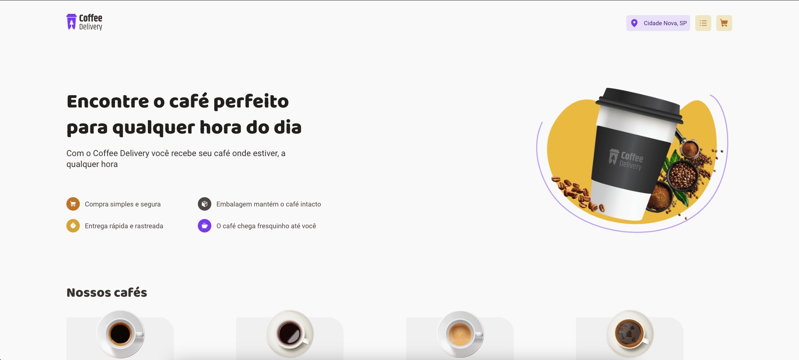
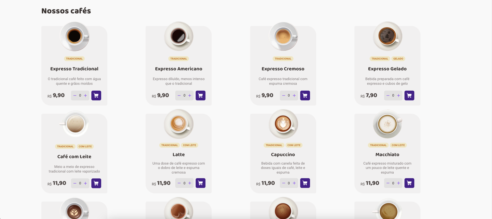
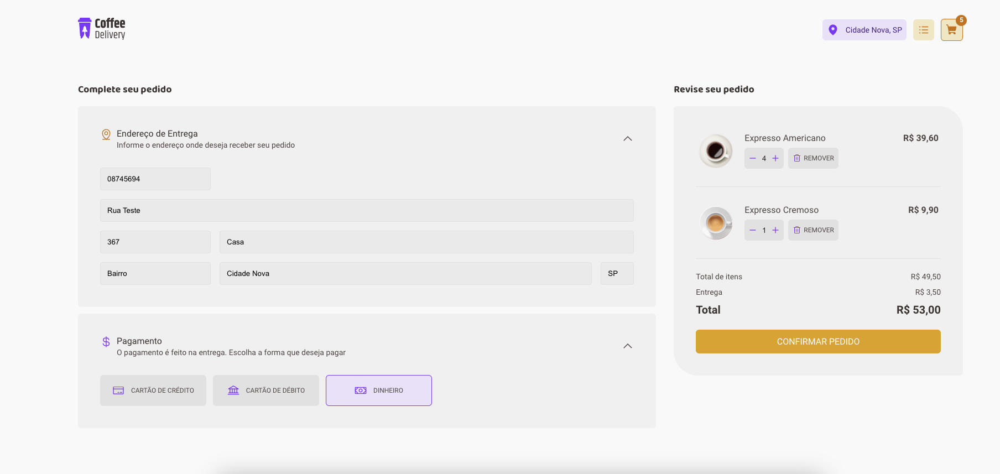
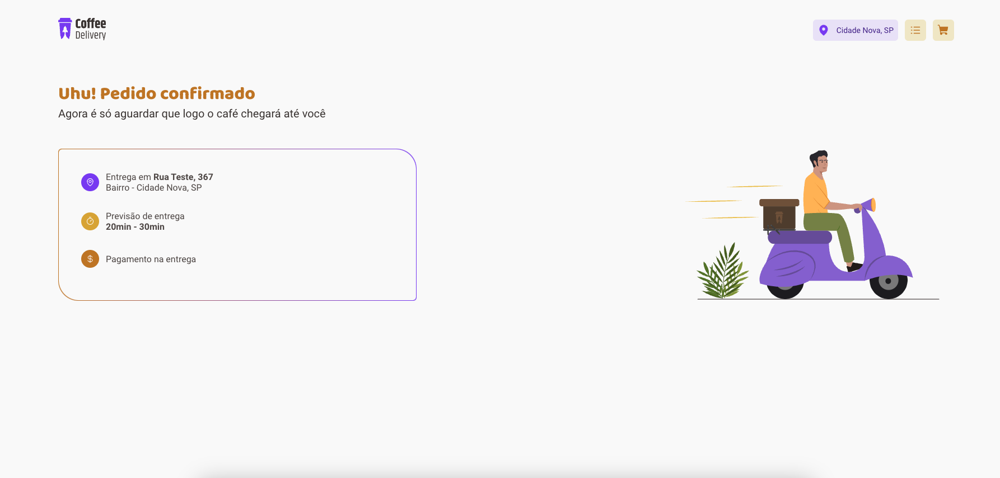

# Coffee Delivery

O Coffee Delivery é um projeto de estudo desenvolvido através da plataforma Rocketseat. Este projeto consiste em um e-commerce básico de compras de cafés. Foi construído com o objetivo de demonstrar o uso de tecnologias modernas, como Vite e Styled-Components, para criar uma experiência de compra de café online.

## Índice

- [Tecnologias Utilizadas](#tecnologias-utilizadas)
- [Capturas de Tela](#capturas-de-tela)
- [Requisitos de Instalação](#requisitos-de-instalação)

## Tecnologias Utilizadas

- Vite: O Coffee Delivery utiliza o Vite como seu bundler de desenvolvimento. O Vite é uma ferramenta de desenvolvimento extremamente rápida que oferece um ambiente de desenvolvimento otimizado para aplicativos web modernos.
- Styled-Components: O Styled-Components é uma biblioteca para estilização de componentes no React. No Coffee Delivery, o Styled-Components é usado para estilizar os componentes da interface do usuário de forma dinâmica.

## Capturas de Tela

<div align="center">
   <h3>Página inicial</h3>
        
    <h3>Listagem de cafés</h3>
        
    <h3>Checkout</h3>
        
    <h3>Pedido realizado</h3>
        
</div>

## Requisitos de Instalação

Para executar o projeto, siga os passos abaixo:

1. Clone este repositório.
```bash
$ git clone https://github.com/ViniciusPonte/ignite-02-coffee-delivery.git
```

2. Instale as dependencias da aplicação
```bash
$ npm i
```

3. Inicie a aplicação através do comando
```bash
$ npm run dev
``````
