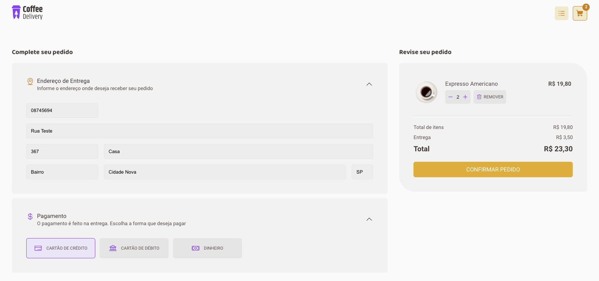

# Ignite - Coffee Delivery

Projeto desenvolvido durante o Ignite, abordando conhecimentos em Context API e useReducer

### Home

  
  

### Checkout

  

### Pedido Concluído

  

### Meus pedidos

  

